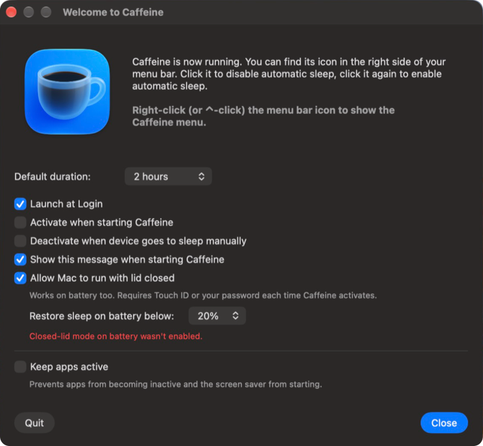
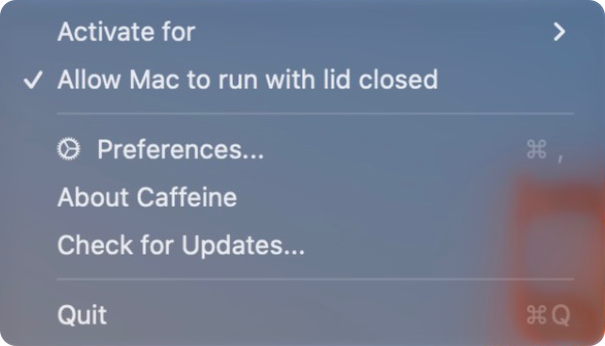
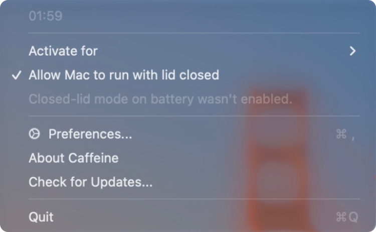

# Caffeine

### Keep your Mac awake — including with the lid closed.

[English](README.md) • [繁體中文](README.zh-Hant.md)

Caffeine is a small menu-bar utility that prevents your Mac from going to sleep, dimming the display, or starting the screensaver. This fork of [`domzilla/Caffeine`](https://github.com/domzilla/Caffeine) adds an **"Allow Mac to run with lid closed"** option that works on AC power and on battery and a **"Launch at Login"** toggle, plus Traditional Chinese localization.

---

## Quickstart

1. Download the latest `Caffeine.app` from the [Releases](https://github.com/bubbleee030/Caffeine/releases) page.
2. Drag it into `~/Applications` (or `/Applications`).
3. Double-click to launch. A coffee-cup icon appears at the right side of the menu bar.
4. **Click** the cup to toggle sleep prevention. **Right-click** (or ⌃-click) for the menu.

## Features

| Feature | What it does |
| --- | --- |
| **Toggle** | Click the menu-bar cup. A full cup = active. An empty cup = your Mac sleeps normally. |
| **Timed activation** | Right-click → *Activate for* → pick 5 min ‥ 5 hours, or *Indefinitely*. |
| **Launch at Login** *(new)* | Preferences → *Launch at Login*. Uses `SMAppService`, no helper. |
| **Allow Mac to run with lid closed** *(new)* | Right-click the cup → *Allow Mac to run with lid closed* (or the same checkbox in Preferences). Keeps a portable Mac running with the lid closed — on AC power **and on battery** — with the screen off. Confirm with Touch ID each time you activate Caffeine; sleep is restored automatically. |
| **Keep apps active** | Simulates HID activity so apps like Teams or Slack stop marking you as "Away". |
| **Deactivate on manual sleep** | Stops Caffeine when you put your Mac to sleep via the Apple menu. |

## Tutorial: the two new toggles

<p align="center">
  
</p>

### Launch at Login

Open Preferences (right-click cup → *Preferences…*) and switch on **Launch at Login**. macOS registers Caffeine as a login item; you can also see it under **System Settings → General → Login Items & Extensions**. Toggling either side keeps the state in sync — Caffeine re-reads `SMAppService.mainApp.status` when its Preferences window opens.

### Allow Mac to run with lid closed

<p align="center">
  
</p>

Switch on **Allow Mac to run with lid closed** — right-click the cup and pick it from the menu (a checkmark shows it's on), or use the checkbox in Preferences. Then activate Caffeine (click the cup). You can now close the lid and the Mac keeps running — on AC power or on battery. Useful for downloads, long renders, or streaming to an external display while the laptop is shut.

**The screen turns off when you close the lid**, as usual; the Mac just keeps working. If an external display is connected, it stays on.

**First time:** Caffeine explains what it's about to do, then macOS asks for your administrator password **once**. Caffeine installs `/etc/sudoers.d/caffeine-lid`, a rule that only lets it run `pmset disablesleep 0` and `pmset disablesleep 1` — nothing else.

**Every activation:** confirm with Touch ID (or your password). When Caffeine activates by itself at launch ("Activate when starting Caffeine"), it skips this step — no prompt at login — so battery mode starts the next time you activate it yourself.

#### If you cancel Touch ID

| When you cancel… | What happens |
| --- | --- |
| right after switching the toggle **on** (Caffeine already active) | The toggle switches back **off** — nothing changes. |
| when **activating** Caffeine with the toggle already on | Caffeine still activates, but lid-closed operation works **only when plugged in (AC power)**. The menu shows a grey *"Closed-lid mode on battery wasn't enabled."* under the toggle. Activate again and confirm Touch ID to get battery mode. |

<p align="center">
  
</p>

**Sleep is always restored** when you deactivate Caffeine, when its timer ends, when you quit it (including `killall Caffeine`), and — if it crashed — the next time it starts. On battery, it also turns off below the level set in **Restore sleep on battery below** (default 20 %). Whenever sleep is restored with the lid already closed and no external display connected, the Mac goes to sleep.

> ⚠️ While closed-lid mode is on, the Mac won't sleep at all — don't leave it running in a bag.

To check the setting in Terminal (`Yes` while closed-lid mode is on):

```bash
ioreg -rn IOPMrootDomain -d 1 | grep '"SleepDisabled"'
```

To remove the rule (Caffeine will ask again next time you use the feature):

```bash
sudo rm /etc/sudoers.d/caffeine-lid
```

If sleep ever stays disabled (e.g. Caffeine was deleted while closed-lid mode was on):

```bash
sudo pmset disablesleep 0
```

## Languages

Caffeine ships with 14 localizations:

> English · 繁體中文 · 简体中文 · 日本語 · 한국어 · Deutsch · Español · Français · Italiano · Nederlands · Português (BR) · Português (PT) · Русский · Українська

The translations of this fork's new strings (Launch at Login and closed-lid mode) are best-effort and welcome native-speaker review — open an issue or PR if a phrasing reads oddly in your language.

## Requirements

- macOS 14.6 (Sonoma) or later
- Apple silicon or Intel

## Building from source

```bash
git clone git@github.com:bubbleee030/Caffeine.git
cd Caffeine
xcodebuild -project src/Caffeine.xcodeproj -scheme Caffeine \
    -destination 'platform=macOS' build CODE_SIGNING_ALLOWED=NO
swift test     # runs the unit tests for the manager classes
scripts/integration-test.sh    # builds and verifies pmset assertion types
```

## FAQ

##### Is this the same Caffeine I've used before?

Yes — it's a feature fork. Tomas Franzén shipped the original in 2006, Michael Jones (IntelliScape) revived it in 2018 under an open-source license, and Dominic Rodemer ([domzilla/Caffeine](https://github.com/domzilla/Caffeine)) rewrote it in SwiftUI in 2025. This fork adds Launch at Login and lid-close support on top of that.

##### Does this work with macOS 10.x?

No, this version requires at least macOS 14.6 (Sonoma). The upstream `domzilla/Caffeine` builds against macOS 11+; older systems are unsupported.

##### How is Caffeine different or better than alternatives (such as Amphetamine, KeepingYouAwake, etc.)?

The point of this fork is to bring Caffeine's signature simplicity *plus* Amphetamine's lid-close behaviour into one menu-bar app. If you already love Amphetamine's session/trigger system, stick with it. If you want a one-click cup with a tiny preferences pane that also keeps your laptop running with the lid shut, this is for you.

## Support

Found a bug or have a feature request? Open an issue on GitHub:

> **<https://github.com/bubbleee030/Caffeine/issues>**

## Credits

- © 2006 **Tomas Franzén** — original Caffeine
- © 2018 **Michael Jones** (IntelliScape) — revived and open-sourced
- © 2022 **Dominic Rodemer** — SwiftUI rewrite, Sparkle updates, multi-language work
- 2026 **[@bubbleee030](https://github.com/bubbleee030)** — Launch at Login, lid-close support, Traditional Chinese

See [`CHANGELOG.md`](CHANGELOG.md) for the full version history.
